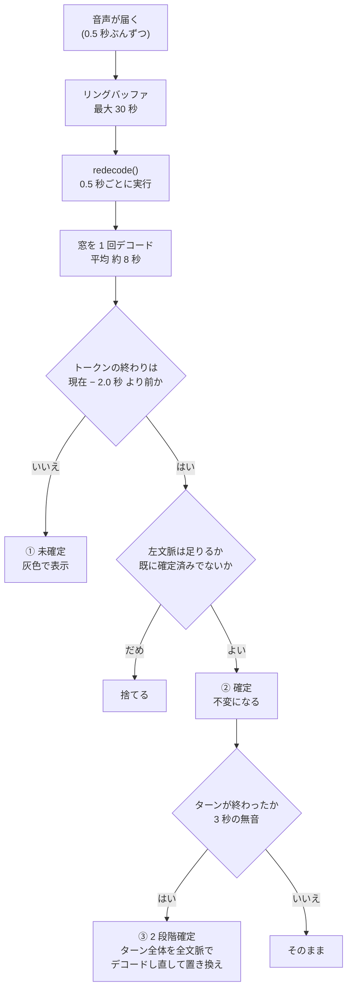
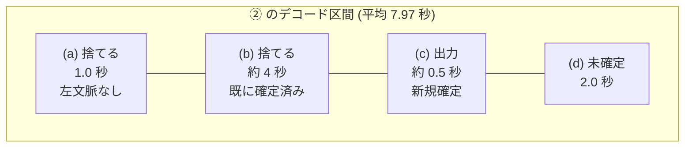

# デコードの窓と 3 段階の確定 — 仕組みの詳細

作成日: 2026-08-14
対象: `src/infer/sliding_window.py`

この文書は「受信した音がどう文字になるか」を、**窓の取り方**と**確定の 3 段階**に
分けて説明する。実測値と、その値の根拠になった測定も併記する。

---

## 0. 用語と設定値

| 記号 | 設定名 | 既定値 | 意味 |
|---|---|---:|---|
| `hop` | `hop_s` | 0.5 秒 | デコードを走らせる間隔 |
| `lag` | `commit_lag_s` | 2.0 秒 | 「現在」からこれだけ前までを確定の対象にする |
| `LC` | `decode_left_context_s` | 5.0 秒 | 確定点より前に与える文脈 |
| `HG` | `head_guard_s` | 1.0 秒 | デコード区間の先頭で捨てる長さ |
| `RING` | `window_s` | 30.0 秒 | 音を保持するリングバッファ |
| `LEAD` | `lead_in_s` | 0.3 秒 | デコード前に足す無音 |
| `GAP` | `line_break_gap_s` | 3.0 秒 | ターンの切れ目とみなす無音 |
| — | `commit_jitter_margin_s` | 0.02 秒 | 中点判定の余裕 |
| — | メルのフレーム間隔 | 0.01 秒 | 時間分解能 (80 サンプル @ 8 kHz) |

**重要な導出値**::

    実効右文脈 = lag + hop / 2 = 2.0 + 0.25 = 2.25 秒

`hop / 2` が入るのは、確定境界が `現在 − lag` にあり、デコードは `hop` ごとにしか
走らないため。あるトークンが確定する瞬間に使えている右文脈は
`[lag, lag + hop)` の範囲にばらつき、**平均が `lag + hop/2`** になる。

---

## 1. 全体像



**①②③ は別々のデコードではない。** ① と ② は**同じ 1 回のデコード結果**を
確定境界で二つに割ったものである。③ だけが独立した追加のデコードになる。

---

## 2. ① 未確定 (provisional)

### 目的

**受信が動いていることを見せるため。** 精度のためではない。

### 動作

`redecode()` が出したトークンのうち、**終わりが `現在 − 2.0 秒` より後にある**もの。
右文脈が足りないので確定させず、灰色で表示する。

```python
# sliding_window.py:322
if abs_end >= commit_limit_abs:
    provisional.append(ct)
    continue
```

### 性質

- **計算量はゼロ。** ② と同じデコード結果の末尾を表示しているだけ
- **最終結果に一切影響しない。** 次の hop で必ず捨てられ、②は別途計算し直される
- **精度は低い。** 右文脈がほとんど無い状態の読みなので、運用上は「ほぼ間違い」
- 画面の「未確定」チェックボックスで消せる (`main_window.py:227`)

---

## 3. ② ライブ確定 — 7.5 秒の窓

### 目的

**受信しながら読める文字を作る。** これが実運用で読んでいる文字のほぼすべて。

### 窓の取り方

`anchor` = 前回の確定点 (`last_commit_end`) とすると::

    デコード区間 = [ anchor − LC , 現在 ]
                 = [ anchor − 5.0 秒 , 現在 ]

**長さは固定ではない。** `現在 − anchor` は通常 `lag`(2.0) + `hop`(0.5) 程度だが、
確定が進まないと伸びる。

| | 値 |
|---|---:|
| 名目 | LC + lag + hop = 5.0 + 2.0 + 0.5 = **7.5 秒** |
| 実測の平均 | **7.97 秒** |
| 実測の最大 | **11.77 秒** |
| 上限 | リングの 30 秒 |

### 区間ごとの役割

```
anchor−5.0      anchor−4.0         anchor        現在−2.0        現在
    |───────────────|──────────────────|──────────────|─────────────|
      (a) 捨てる       (b) 捨てる          (c) 新規確定     (d) 未確定
      左文脈なし      既に確定済み        ← ここだけが出力    灰色表示
      HG = 1.0 秒                        1 hop ぶん ≈ 0.5 秒
    ←────────── 確定済みの範囲 ──────────→
```

| 区間 | 何が起きるか | 根拠のコード |
|---|---|---|
| (a) | トークンを**捨てる**。窓の切断で符号が分断されうるので信用しない | `sliding_window.py:326` |
| (b) | デコードはするが**中点ウォーターマーク**で既確定と判定して捨てる | `sliding_window.py:332` |
| (c) | **新たに確定する。これが唯一の出力** | `sliding_window.py:348` |
| (d) | ① 未確定になる | `sliding_window.py:322` |

**(a)(b) は無駄ではない。** 出力にはならないが、(c) を正しく読むための文脈である。
ここを削るとモデルは境界の直後を「音の立ち上がり」と誤認して幻覚を出す
(実測で held-out 21 件中 18 件、先頭に余計なトークンが出た)。

#### (a) は何のためにあるか — **窓の切断で符号が分断されるから**

デコード区間を `anchor − 5.0 秒` で切ると、**そこに跨っていた符号は途中で断ち切られた
状態**でモデルに入る。断片は別の符号として読まれるので、切断面の付近に出たトークンは
信用できない。これが 1 秒を捨てる理由である。

設計書 §4.4 に、この方式に移る前の症状が記録されている。固定長でチャンクを切っていた
頃は「**文字途中で切れて誤認識**」「**先頭部分が決まって失敗する**」という現象があり、
その対策として導入された。

#### (a) の 1 秒は「1 文字の長さ」の上限ではない

「先頭 1 秒を捨てる」と書くと、**1 秒を超える符号 (12 WPM 以下) が捨てられるのでは**
と読めるが、そうはならない。位置関係が構造的に守っている::

    デコード区間の先頭 = anchor − 5.0 秒
    head_cut         = デコード区間の先頭 + 1.0 秒 = anchor − 4.0 秒

**捨てる位置は確定点より 4 秒後ろ**であり、確定点より前の音は定義上すべて確定済み
である。危険になるのは「4 秒以上かかる 1 文字」が存在するときだけで、12 WPM の
最長符号 (6 要素) でも約 1.7 秒、3 WPM 程度まで落ちないと 4 秒には届かない。

実測 (2026-08-14)::

    105 秒の録音 (13.8 WPM): 捨てた 282 個、**うち未確定は 0 個**、確定点との差 最小 4.01 秒
     62 秒の録音 (18.2 WPM): 捨てた 217 個、**うち未確定は 0 個**、確定点との差 最小 4.05 秒

この 1 秒は**モデルに左文脈を与えるための助走**であって、文字の長さの制約ではない。
なお**交信の冒頭だけは無効**になる (`decode_start_abs > 0` の条件)。そうしないと
1 文字目が必ず消える。

### シフト量

**確定境界は hop ごとに 0.5 秒ずつ進む。**
`commit_limit = 総投入サンプル数 − lag` で、総投入サンプル数が hop ぶん増えるため。

**「0.5 秒」は境界の進む距離であって、確定できる文字の長さの上限ではない。**
2 秒かかる文字は 4 回ぶんの hop を未確定のまま待ち、境界が追い越した回に確定する。
取りこぼしは起きない。

### 確定の 3 条件

トークンが確定するには次を**すべて**満たす必要がある。

1. **終わりが `現在 − 2.0 秒` より前** — 右文脈が足りていること
2. **始まりが `デコード区間の先頭 + 1.0 秒` より後** — 左文脈があること
   (ただし**ストリームの先頭では無効**。交信の 1 文字目を捨てないため)
3. **中点が前回の確定点より後** — 既確定の再出現でないこと

さらに 2026-08-14 に 4 つ目を追加した。

4. **次のトークンが「まだ確定できない濁点」でないこと** — 濁点は基本カナと別の
   トークンなので、基本カナだけ先に確定すると画面に清音が出てしまう
   (`デ` が `テ` に見え、1〜3 hop 後に直る)。実受信 105 秒で 9 回起きていた

### 実測 (105 秒の実受信、13.8 WPM)

| 項目 | 値 |
|---|---:|
| `redecode()` の回数 | 211 回 |
| 1 回にデコードする音 | 平均 7.97 秒 |
| 1 回に出るトークン | 平均 8.0 個 |
| **1 回に新たに確定する数** | **平均 0.50 個** |
| **1 個も確定しなかった回** | **117 / 211 回** |
| 同じ音をデコードした回数 | 平均 **16 倍** |

半分以上の回で 1 文字も確定していないのは、13.8 WPM で 1 文字に約 1 秒かかり、
hop 0.5 秒の 2 回に 1 文字しか進まないため。**正常な動作である。**

### 2.25 秒の根拠

held-out 21 件、正解ラベルとの CER 実測 (`docs/commit_lag_sweep_result.md` §8)。

| `lag` | 実効右文脈 | CER |
|---:|---:|---:|
| 0.75 | 1.00 秒 | 25.45% |
| 1.00 | 1.25 秒 | 23.38% |
| 1.25 | 1.50 秒 | 21.56% |
| 1.50 | 1.75 秒 | 21.82% |
| **2.00** | **2.25 秒** | **19.74%** ← 最良 |
| 2.75 | 3.00 秒 | 20.78% |

**単調改善ではなく 2.25 秒付近に山がある。** 3.00 秒は 2.25 秒より遅くて精度も悪い。
縮める方向は高くつく (1.5 秒で +1.8pt、1.0 秒で +5.7pt)。

この値は**一度ひっくり返っている**。以前は「2.5 秒を維持、下げられない」と
結論していたが、それは**学習データそのもの**に対して**「オフライン一括デコードとの
一致率」という代理指標**で測ったものだった。一致率は正しさではない。

---

## 4. ③ 2 段階確定 (refine_closed_turns)

### 目的

**②が凍結してしまった「区切り方の誤り」を、やり直して直す。**

②は一度確定すると変えられない。たとえば `テ`(・-・--) をモデルが一旦
`ロ`(・-・-) + `ム`(-) と読み、`ロ` の終わりが境界より前だった場合、`ロ` は凍結され、
あとから `ム` と併合して `テ` に直すことはできない。③はターン全体を読み直すので、
**区切り方ごと置き換えられる。**

### 動作条件

**ターンが「終わった」と判定され、かつその音がリングに残っていること。**

ターンは `GAP` (3.0 秒) 以上の無音で区切る。終わったとみなすのは次のいずれか。

- 次のターンが既に始まっている
- 末尾から `GAP + lag` (= 5.0 秒) 以上の無音が続いた
- `all_turns=True` (停止時。もう音は増えない)

**諦める条件**:

- **ターンの先頭の音がリングから落ちている** (`start_abs < ring_start_abs`)
- 既に一度直したターンである (書き換えは**ターン終了時に 1 回だけ**)
- 置き換え結果が空 (見えていた文字を黙って消さない)

### デコードする長さ

```
区間の始まり = 前のターンの最後の音 + 0.25 秒   (前のターンが無ければリングの先頭)
区間の終わり = 次のターンの最初の音 − 0.25 秒   (次のターンが無ければ現在)
           + 先頭に 0.3 秒の無音を足す
```

**単独のターンなら区間はリング全体 (最大 30 秒) になり、オフラインで一括デコード
したのとまったく同じ入力になる。** これが③が最も正確になる理由。

固定長の余白ではなく「隣のターンの手前までの無音を全部含める」のが要点。
無音の量が変わると特徴量の正規化が変わり、同じ音でも結果がずれるため。
固定 0.5 秒の余白では held-out でオフラインに 1.3pt 届かなかった。

### 効果 (held-out 21 件)

| 段階 | TER |
|---|---:|
| ②のみ | 27.4% |
| ③まで | **25.1%** |
| (参考) オフライン全文脈 | 24.2% |

### 実測: 実際にはほとんど走っていない

| 録音 | 長さ | 3 秒以上の無音 | ターン | ③が結果を変えた回数 |
|---|---:|---:|---|---:|
| 20260814_151135 | 105.3 秒 | **0 箇所** | 1 個 (105 秒) | **0** |
| 20260814_052617 | 62.5 秒 | **0 箇所** | 1 個 (62 秒) | **0** |

相手が 3 秒以上黙らずに送り続けたため、ターンが 1 つのまま 30 秒のリングを超え、
**③は「音がもう無い」として諦めている。**

**つまり実運用で読んでいる文字のほぼすべてが②の結果である。**

---

## 5. 速度との関係 — 窓は「秒」だが必要なのは「文字数」

窓はすべて秒で決まっているが、モデルが必要とするのは**文字数ぶんの文脈**である。
遅い相手ほど、同じ秒数に入る文字数が減る。

| 速度 | 1 文字あたり | 右文脈 2.25 秒 | 左文脈 4 秒 |
|---:|---:|---:|---:|
| 13.8 WPM | 約 1.0 秒 | **約 2 文字** | **約 4 文字** |
| 18.2 WPM | 約 0.7 秒 | 約 3 文字 | 約 6 文字 |
| 24 WPM | 約 0.55 秒 | 約 4 文字 | 約 7 文字 |
| 40 WPM | 約 0.33 秒 | 約 7 文字 | 約 12 文字 |

(1 文字あたりの時間は実録音 2 件のトークン数と長さからの概算。無音を含む)

**13.8 WPM では右文脈が実質 2 文字しかない。** 24 WPM の半分である。
そして 2026-08-14 に調べた 2 件の録音はどちらも遅く、どちらもデコードが悪かった。

---

## 6. 数字のまとめ



| 問い | 答え |
|---|---|
| ①は別のデコードか | **いいえ。**②と同じ結果の末尾。計算量ゼロ |
| ②の窓は何秒か | 名目 7.5 秒、実測平均 7.97 秒、最大 11.77 秒 |
| ②のシフト量は | **0.5 秒** (hop と同じ)。境界が進む距離であって文字長の上限ではない |
| ②が 1 回に出す文字数は | 平均 0.5 個。半分以上の回はゼロ |
| 左文脈 5 秒は出力になるか | **ならない。**文脈として与えるだけ。実質 4 秒 (先頭 1 秒は捨てる) |
| ③はいつ走るか | ターンが終わり、その音がリング (30 秒) に残っているとき |
| ③は何秒デコードするか | ターン全体。単独ターンならリング全体 = 最大 30 秒 |
| 遅い信号で不利か | **文脈が文字数で痩せる。**13.8 WPM では右文脈が約 2 文字 |

---

## 7. 分かっている弱点と、試せる改善案

いずれも**学習不要**で、held-out 21 件でそのまま効果を測れる。

| # | 案 | 狙い | 懸念 |
|---|---|---|---|
| 1 | リング窓 30 秒 → 拡大 | ③を長いターンにも届かせる | メモリは 30 秒で約 1 MB なので 120 秒でも 4 MB。ターン終了時のデコードが 30 秒 → 120 秒で約 112 ms → 450 ms |
| 2 | 左文脈 5 秒 → 拡大 | ②そのものの文脈を増やす | 5 秒は掃引で決めた値ではなく**CPU 負荷対策の打ち切り**。hop ごとに走るので費用は直接効く |
| 3 | **窓を相手の速度に比例させる** | 遅い信号で文脈が痩せる問題を直す | 受信 WPM 推定は既にアプリにある。held-out に速い録音も遅い録音も混ざっているので判定できる |

**3 が 2026-08-14 に調べた 2 件の失敗を最もよく説明する。**

### 掃引するときの注意

- **`lag` と `hop` は和で効く。** 片方だけ動かすと右文脈が静かに失われる
  (過去に hop だけ縮めて踏んでいる)
- **hop の既定は 3 箇所にある** (`AppSettings` / `AudioInferenceWorker` /
  `SlidingWindowDecoder`)。変えるときは 3 つとも揃えること
- **評価は held-out に正解ラベルで当てる。** 「オフライン結果との一致率」のような
  代理指標で測ると結論が逆に出る (実際に一度ひっくり返っている)
- **掃引の形が変なときは実装のバグを疑う。** 「余白を増やすほど悪くなる」という
  逆向きの結果が、実際には書き直しを諦める分岐のバグだった

---

## 8. 参照

| 内容 | 場所 |
|---|---|
| 実装 | `src/infer/sliding_window.py` |
| 設定と既定値 | `src/infer/settings.py` |
| `lag` の掃引結果 | `docs/commit_lag_sweep_result.md` §8 |
| モデルと精度の全体像 | `docs/model_baseline_and_improvement_plan.md` |
| 助走の無音 (0.3 秒) の根拠 | `src/infer/sliding_window.py` の `DEFAULT_LEAD_IN_S` |
